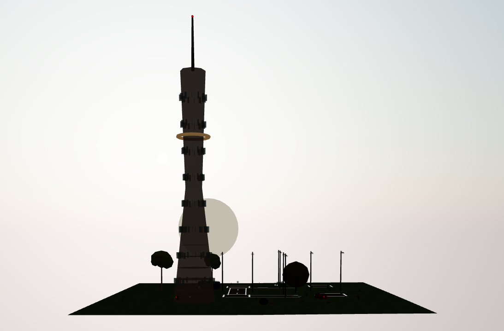

# PCG World

> **Procedural Content Generation** — A Three.js-based procedural city generation & real-time rendering engine

<p align="center">
  
</p>
<p align="center"><em>Real-time procedural city · Day/Night cycle · Dynamic weather · AI traffic</em></p>

---

## Features

### Terrain Generation
- **6 terrain types**: Plains / Mountains / Islands / Coastal / Suburban / City
- Simplex noise-driven FBM (Fractal Brownian Motion) height field
- Gradient-based adaptive texturing (sand -> grass -> rock -> snow line)
- Real-time water reflections (Three.js Water Shader)

### Procedural City
- **Grid road system**: Auto-connectivity detection, intersection filtering
- **10+ building styles**: Glass curtain, twin towers, setback, dome, brick, cottage, balcony, etc.
- **Landmark buildings**: Canton Tower, Shopping Mall
- **Traffic lights**: Auto phase cycling (Green -> Yellow -> Red)
- **Street lights**: SpotLight + glow disc + shadow casting, auto-on at night
- **Crosswalks**: White stripes on all 4 intersection sides

### AI Traffic
- **5 vehicle types**: Sedan, Bus, Fire Truck, School Bus
- Route following + intersection turn smooth interpolation
- **Collision avoidance**: distance detection + adaptive speed control
- Headlight SpotLight projecting real light beams
- Emissive tail light materials

### Dynamic Sky
- **Real sun orbit**: rises from east, peaks at noon, sets in west
- Atmospheric scattering (Sky Shader with dynamic turbidity)
- Sunrise/sunset warm color gradients + horizon lens magnification
- **Star field**: 0~100 density slider, twinkling animation
- ACES filmic tone mapping

### Weather System
- **Clear / Rain / Snow** three modes
- GPU particle systems (shader-driven raindrops & snowflakes)
- **Snow accumulation**: terrain shader blending, building roof caps, tree canopy snow
- Fog effects

### More
- Fire particle system (chimneys & campfires)
- **Lighthouse**: rotating beam + pulse flicker + red beacon
- Rich vegetation (Oak, Pine, Birch, Maple, Palm, Willow, Spruce, Cypress, etc.)
- Grass tufts, flowers, rock ground cover

---

## Controls

| Category | Control | Description |
|----------|---------|-------------|
| **Terrain** | PLAINS / MOUNTAINS / ISLANDS / COASTAL / SUBURB / CITY | Switch terrain type |
| **Houses** | 1~30 | Number of houses |
| **Vehicles** | 0~20 | Vehicle count (city mode only) |
| **Road** | Density 20~80 | Road grid density |
| **Light** | Spacing 6~24 | Street light spacing |
| **Weather** | CLEAR / RAIN / SNOW | Weather toggle |
| **FX** | FIRE / LIGHT | Fire toggle / City lights toggle |
| **Time** | 0:00 ~ 24:00 | Day/night time slider |
| **Seed** | 1~999 | Random seed (regenerates entire map) |
| **Stars** | 0~100 | Star field density |

---

## Quick Start

```bash
git clone https://github.com/new-tonAA/PGC.git
cd PGC

# Start a local server
npx serve .
# or
python -m http.server 8000

# Open http://localhost:8000
```

> Pure frontend, no `npm install` needed. Three.js loads via CDN import map.

---

## Architecture

```
PGC/
├── index.html              # Entry point + UI panel + import map
├── images/
│   └── README1.png         # Screenshot
├── js/
│   ├── main.js             # Main controller & render loop
│   ├── terrain.js          # Terrain generation + water
│   ├── city.js             # City grid, roads, buildings, vehicles
│   ├── house.js            # Procedural house generation
│   ├── vegetation.js       # Vegetation system (10+ tree types)
│   ├── weather.js          # Weather particle system
│   ├── fire.js             # Fire particle system
│   └── noise.js            # Simplex noise implementation
└── README.md
```

### Core Dependencies

| Library | Purpose |
|---------|---------|
| [Three.js](https://threejs.org/) v0.160 | 3D rendering engine |
| OrbitControls | Camera rotation/zoom/pan |
| Sky Shader | Procedural sky |
| Water Shader | Water surface reflections |

### Design Principles
- **Decoupled systems**: Terrain, city, houses, vegetation generate independently
- **Pure procedural**: No external model files, all geometry is code-generated
- **Real-time**: All lighting, shadows, particles computed on GPU

---

## Camera

| Action | Result |
|--------|--------|
| Left mouse drag | Rotate |
| Right mouse drag | Pan |
| Scroll wheel | Zoom |
| Left panel UI | Switch terrain/weather/time etc. |

---

## License

MIT (c) new-tonAA

---

<p align="center">
  <sub>Made with Three.js · Procedural Generation · Real-time Rendering</sub>
</p>
